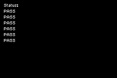

# BIOS CPU Test

This example ROM currently tests some usages of the `gba.bios.cpuSet` and `gba.bios.cpuFastSet` BIOS calls, to verify correctness of the Zig wrappers. Several tests are run, and if all run correctly then the ROM will display all "PASS" text as status output. Any failures will result in a "FAIL" text.
