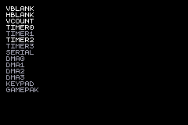

# Interrupts

This example ROM demonstrates how to use the GBA's hardware interrupts.

Names of each of the fourteen hardware interrupts are drawn in a column on the left side of the screen. The names are a mid-gray color by default, but are drawn white if the corresponding named interrupt was triggered within the last few frames.

In practical terms, this means that:

- The "VBLANK", "HBLANK", and "VCOUNT" names should be white every frame.

- The "TIMER0" name should flash white sixteen times per second (i.e. it should blink rapidly), the "TIMER1" name should flash once per 4096 seconds (roughly once per 68 minutes), the "TIMER2" name should flash four times per second, and the "TIMER3" should flash once per second.

- The "KEYPAD" name should show as white whenever any button is held down.

- The other names should remain gray. (They are not as easily tested/demonstrated.)

The `handleInterrupt` function is defined with the signature `fn(flags: gba.interrupt.InterruptFlags) callconv(.c) void`, which makes it possible to assign it as ZigGBA's interrupt handling function via `gba.interrupt.isr_default_redirect = handleInterrupt`. This causes all interrupt handling to be routed through this function. In the example, the function simply records the last frame number at which any interrupt triggered, so that the interrupt names can be displayed with the appropriate color.

Note that the example initializes many more hardware registers than only `gba.interrupt.master` and `gba.interrupt.enable`. This is because most interrupts have additional flags in registers related to their specific system functions that decide whether interrupts should be emitted for certain events, or that may configure the cirumstances under which they are emitted.
