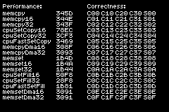

# Memory

This ROM demonstrates various methods of copying or filling memory on the GBA, including a set of functions implemented by ZigGBA named `gba.mem.memcpy`, `gba.mem.memcpy16`, `gba.mem.memcpy32`, `gba.mem.memset`, `gba.mem.memset16`, and `gba.mem.memset32`.

Names of sixteen different memory copying and filling functions are drawn in a column on the left side of the screen. Immediately to the right of these names are hexadecimal numbers counting the number of CPU cycles that it took to copy or to fill 4 kb (4096 bytes) of memory in EWRAM.

On the right side of the screen are status indicators for a suite of tests verifying the correct behavior of ZigGBA's own memory copying and filling functions, which should be expected to have very similar performance to the `CpuFastSet` BIOS call (for word-aligned memory) while being more permissive in the inputs they accept. If there were any red text, this would indicate failed test cases.
