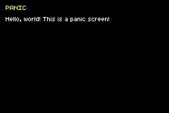

# Panic

This example ROM demonstrates how to use ZigGBA's default custom `@panic` handler.

 

When the ROM starts, a solid green screen should be displayed. Upon pressing the "A" button, a `@panic` is triggered which results in a transition to a new screen with a black background, displaying the text "PANIC" in yellow and "Hello, world! This is a panic screen!" in white.

The custom panic handler is enabled via this line in the example code:

```zig
pub const panic = gba.debug.std_panic;
```
