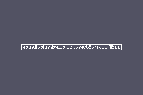
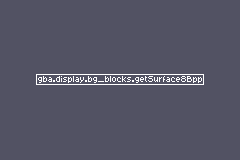
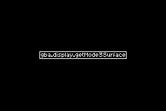
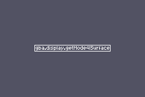
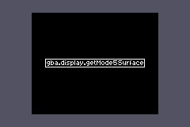

# Interrupts

This example ROM demonstrates drawing to different surface types, representing 4bpp tiles, 8bpp tiles, a mode 3 bitmap, a mode 4 bitmap, and a mode 5 bitmap, respectively.

Use the left and right buttons to cycle through each of these screens. In each case, a string identifying the kind of surface should be drawn as text in the center of the screen, with a rectangular outline.

In the case of the mode 5 drawing, the undersized mode 5 canvas is centered within the screen.

Some very brief visual glitches when switching from one graphics mode to another are to be expected.
